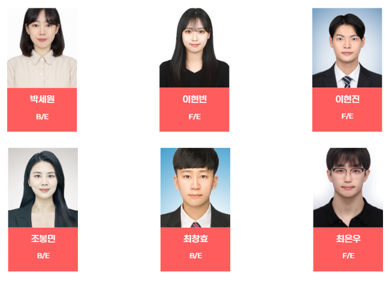

#  favS2hare - 유튜브 콘텐츠 기반 SNS

## ✔ 소개
*- 내 최애를 골라보고 POP을 통해 자랑하고 피드를 꾸며 타인과 공유할 수 있는 SNS -*

## ✔ 주요 기술
---

**Backend - Spring**
- Eclipse 2020-03 (4.15.0)
- Spring Data JPA
- Spring Web
- Swagger 3.0.0

**Frontend**
- Visual Studio Code IDE
- Vue 2.7.8
- Vuetify 2.6.7
- Vuex 3.6.2

**CI/CD**
- Jenkins
- NGINX

## ✔ 협업 툴
---
- Git
- Notion
- Gether Town
- JIRA
- Slack
- MatterMost
- Webex

## ✔ 팀원 역할 분배
---

## ✔ 프로젝트 산출물
---
- [기능정의서](./docs/기능정의서.md)
- [와이어프레임](./docs/와이어프레임.md)
- [컴포넌트다이어그램](./docs/컴포넌트_다이어그램.md)
- [API](./docs/API.md)
- [ERD](./docs/ERD.md)
- [기술스택](./docs/기술스택.md)

## ✔ 프로젝트 결과물
- [중간발표자료](./docs/ppt/)
- [최종발표자료](./docs/ppt/)

## favS2ahre 서비스 화면
---

### 회원가입 
- 이메일을 중복해서 사용할 수 없습니다.

(이미지넣기)

 

### 홈화면
- 유튜브 탭
(이미지넣기)

- 친구 피드 탭
(이미지넣기)

 

### 유튜브 상세정보
- 유튜브 편집 및 북마크
(이미지넣기)

 

### 팝 생성 화면
- 시간 지정, 피드 설정 후 팝 생성
(이미지넣기)

 

### 팝 탭
- 사용자의 선호도에 맞는 팝 리스트 

(이미지넣기)

 

### 팝 상세 화면
- 팝 좋아요 수, 댓글 상세 정보 확인

(이미지넣기)

 

### 검색 탭
- 검색어에 맞는 팝, 동영상, 유저 정보
- 더보기 제공

(이미지넣기)

 

### 프로필 탭
- 유저의 프로필 정보와 피드 정보

(이미지넣기)

 

### 프로필 정보 변경
- 비밀번호를 변경할 수 있습니다.
- 프로필이미지, 닉네임, 자기소개 글을 변경할 수 있습니다.

 

### 다중 피드
- 유저가 생성한 다중 피드에 팝 리스트 

(이미지넣기)

 

### 선호도 조사
- 유저가 회원가입 후 선호하는 아이돌, 노래 선택 

(이미지넣기)

 

### 저장한 유튜브 보기
- 설정 페이지에서 좋아요한 플레이리스트, 플레이룸, 게시글 목록을 확인할 수 있습니다.

(이미지넣기)

 

### 로그아웃
- 로그아웃하면 비회원으로 사용
- 비회원 사용자는 좋아요, 댓글 특정 화면 제한.
(이미지 넣기)
