# :iphone: favS2hare - 유튜브 콘텐츠 기반 SNS

<!--  -->

## :date: 프로젝트 진행 기간
2022.07.11 ~ 2022.08.19 ( 40일간 진행 )
 
SSAFY 7기 2학기 공통프로젝트 A803 덕지덕질 - favS2hare

## ✔ 소개

_- 내 최애를 골라보고 POP을 통해 자랑하고 피드를 꾸며 타인과 공유할 수 있는 SNS -_

## ✔ 기획의도

_- 모바일 플랫폼을 통해 아이돌 굿즈, 정보를 편하게 얻을 수 있지만
 
그와 더불어 현질을 통해 정보의 차별화를 두기에 모두 공평한 덕질을 하기에 어려움이 있습니다.  
저희는 이를 해결하고자 팬들이 순수하게 덕질하고 팬들끼리의 소통을 할 수 있는 모바일 플랫폼 제작을 기획했습니다. -_

## ✔ 주요 기능

- Pop 
    - Pop이란 favS2ahre에서 자체적으로 정의한 짧은 영상을 의미합니다.
    - 자신이 좋아하는 아티스트의 youtube 동영상을 원하는 구간으로 편집해 쉽게 Pop을 제작할 수 있어요.
    - 내가 시청한 youtube 영상으로 만든 다른 사람들의 Pop을 볼 수 있어요.

- SNS 기능
    - 나와 선호하는 아티스트가 비슷한 유저를 팔로우해서 해당 유저의 Pop을 친구피드에서 볼 수 있어요.
    - 다른 유저가 제작한 Pop에 좋아요, 댓글, 댓글 좋아요를 눌러 자신의 의견을 남길 수 있어요.

- 추천 기능
    - 선호하는 아티스트 정보에 기반하여 youtube 영상을 추천받을 수 있어요.
    - 조회수, 좋아요수, 팔로우 정보 등의 정보를 바탕으로 내가 선호하는 Pop을 추천받아 시청할 수 있어요.

## ✔ 주요 기술

**Backend - Spring**

- Spring Tool Suite 3
- Spring boot 2.7.1
- Spring Data JPA
- Spring Web
- Swagger 3.0.0
- Mysql DB 8.0.30-0
- ubuntu0.20.04.2

**Frontend**

- Visual Studio Code IDE
- Vue 2.7.8
- Vue-router 3.5.1
- Vuex 3.6.2
- Vuetify 2.6.7

**CI/CD**

- AWS EC2
- Docker
- NGINX
- Certbot

## ✔ 협업 툴

- Git
- Notion
- JIRA
- MatterMost
- Webex
- Discord
- Visual Studio Code Live Share

## ✔ 프로젝트 파일 구조 
- [파일 구조](./docs/파일구조.md)

## ✔ 팀원 역할 분배

## ✔ 프로젝트 산출물

- [기능정의서](./docs/기능정의서.md)
- [와이어프레임](./docs/와이어프레임.md)
- [컴포넌트다이어그램](./docs/컴포넌트_다이어그램.md)
- [API](./docs/API.md)
- [ERD](./docs/ERD.md)
- [기술스택](./docs/기술스택.md)
- [UCC](./docs/UCC.md)
- [(서버)아키텍쳐](./docs/아키텍쳐.md)

## ✔ 프로젝트 결과물

- [포팅매뉴얼](./docs/포팅매뉴얼.md)
- [중간발표자료](./docs/공통PJT_A803_중간발표자료.pdf)
- [최종발표자료](./docs/공통PJT_A803_최종발표자료.pdf)

## ✔ favS2ahre 서비스 화면

### 회원가입

- 이메일을 중복해서 사용할 수 없습니다.
- 유효한 이메일인지 사용자의 이메일에 인증번호를 보내 검증합니다.

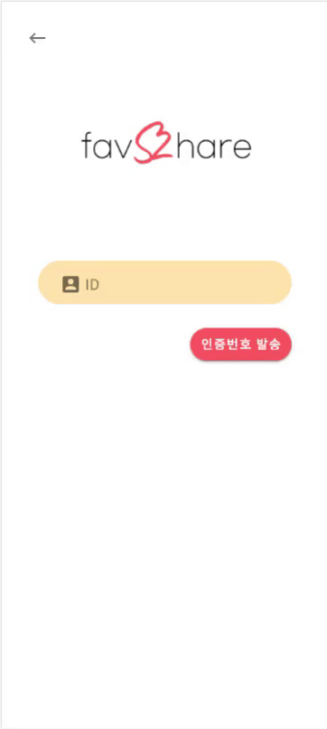
 

### 홈 화면

- 유튜브 탭
    - 사용자의 선호 아티스트 정보를 반영하여 youtube 영상을 보여줍니다.
    - 무한 스크롤이 적용됩니다.

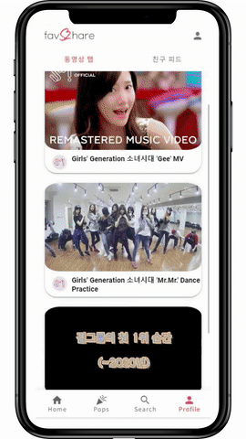
 

- 친구 피드 탭
    - 사용자가 팔로우하고 있는 친구들의 Pop을 보여줍니다.
    - 친구가 없는 경우, 나를 팔로우 하는 유저 또는 관심사가 비슷한 유저의 Pop을 보여줍니다.
     
    
     

### Youtube 상세 화면

- 편집을 원하는 youtube 영상을 선택하면 유튜브 상세 페이지로 이동합니다.
- 해당 youtube 영상으로 제작된 Pop을 같이 볼 수 있습니다.
- 상세 페이지에서는 원하는 영상을 편집하거나 북마크하여 나중에 편집할 수 있습니다.
- 북마크한 영상은 사용자 버튼을 클릭하여 확인할 수 있습니다.

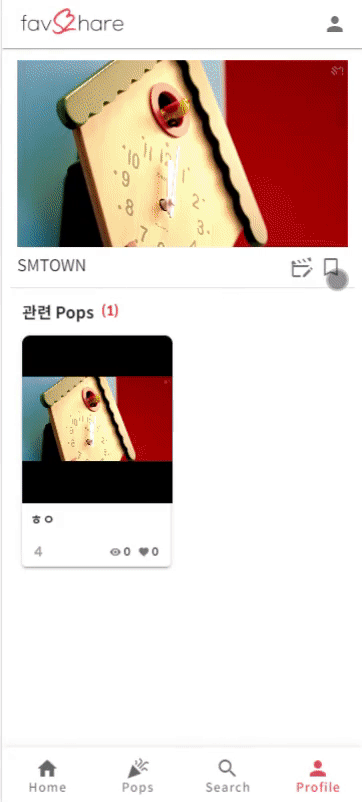
 

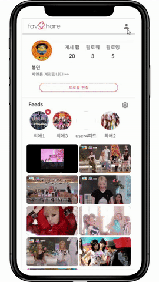

 

### Pop 게시

- 원하는 영상의 구간을 설정하여 쉽게 Pop을 제작할 수 있습니다.
- 제목과 설명을 입력하고, 나의 여러가지 피드 중에서 게시를 원하는 피드를 선택하여 Pop을 게시합니다.

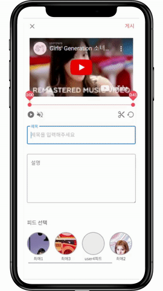

 

### Pop
- Pop 탭 
    - 사용자의 선호도에 맞는 Pop 목록을 알고리즘에 의해 추천받을 수 있습니다.
    - 선호하는 아티스트의 카테고리를 클릭하여, 선호도에 기반한 Pop을 추천받을 수 있습니다.

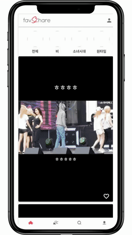

 

- Pop 상세 화면
    - 자신이 좋아하는 Pop에 '좋아요' 또는 '좋아요 해제'를 할 수 있습니다.
    - 댓글을 확인하고 댓글 작성, 삭제, 댓글 좋아요를 할 수 있습니다.
    - Pop의 제목, 설명, 조회수, 좋아요 등의 정보를 확인할 수 있습니다.
     
    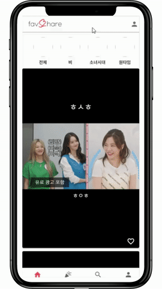

 

### 검색하기
- 검색어를 입력하여 연관된 Pop, youtube 영상, User를 찾을 수 있습니다.
- 더보기를 제공하여 원하는 항목을 자세히 볼 수 있습니다.

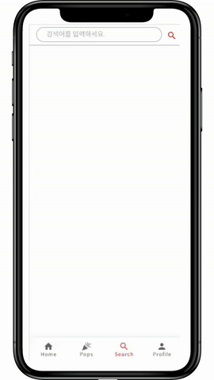

 

### Profile 탭

- Profile
    - User의 프로필 정보를 확인할 수 있습니다.
    - 게시한 Pop의 수, 팔로워, 팔로잉 정보, 닉네임과 프로필 소개 등의 정보를 표시합니다.
    - User는 여러 개의 다중피드를 가지고 있으며 각각 다른 컨셉으로 꾸밀 수 있습니다.
    - 각 피드별 Pop을 볼 수 있습니다.

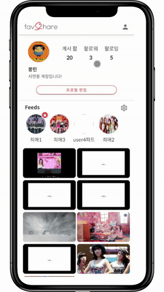

 

- Profile 정보 수정하기
    - 닉네임과 자기소개 글을 변경할 수 있습니다.

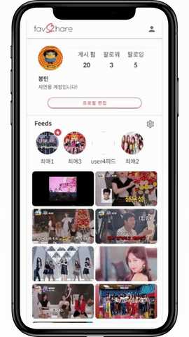
 
 
- 다중 피드
    - 여러 아티스트를 좋아할 경우, 각각 피드를 만들어 원하는 컨셉으로 꾸밀 수 있습니다.
    - 피드별로 Pop을 추가 및 삭제할 수 있습니다.

 

### 관심사 설정

- User가 선호하는 아티스트, 노래(분위기)를 선택할 수 있습니다.
- 모든 User는 회원가입시 선호도 조사를 하게 됩니다.
- 관심사는 언제든 원할 때 변경 가능합니다.

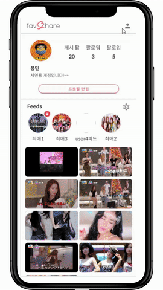

 

### 로그아웃

- 로그아웃한 User는 비회원으로 이용하게 됩니다.
- 비회원은 좋아요, 댓글과 같은 기능들의 사용이 불가능하며, 특정 화면에 대한 접근이 제한됩니다.

