#  favS2hare - 유튜브 콘텐츠 기반 SNS

## ✔ 소개
*- 내 최애를 골라보고 POP을 통해 자랑하고 피드를 꾸며 타인과 공유할 수 있는 SNS -*

## ✔ 기획의도
*- 모바일 플랫폼을 통해 아이돌 굳즈, 정보를 편하게 얻을 수 있지만 그와 더불어 현질을 통해 정보의 차별화를 두기에 모두 공평한 덕질을 하기에 어려움이 있습니다.  
저희는 이를 해결하고자 팬들이 순수하게 덕질하고 팬들끼리의 소통을 할 수 있는 모바일 플랫폼 제작을 기획했습니다. -*

## ✔ 주요 기술
---

**Backend - Spring**
- Spring Tool Suite 3
- Spring boot 2.7.1
- Spring Data JPA
- Spring Web
- Swagger 3.0.0
- QueryDSL
- Mysql DB 8.0.30-0
- ubuntu0.20.04.2

**Frontend**
- Visual Studio Code IDE
- Vue 2.7.8
- Vuetify 2.6.7
- Vuex 3.6.2

**CI/CD**
- AWS EC2
- Docker
- NGINX
- SSL
- Jenkins

## ✔ 협업 툴
---
- Git
- Notion
- JIRA
- MatterMost
- Webex
- Discord

## ✔ 팀원 역할 분배
---

## ✔ 프로젝트 산출물
---
- [기능정의서](./docs/기능정의서.md)
- [와이어프레임](./docs/와이어프레임.md)
- [컴포넌트다이어그램](./docs/컴포넌트_다이어그램.md)
- [API](./docs/API.md)
- [ERD](./docs/ERD.md)
- [기술스택](./docs/기술스택.md)
- [UCC](./docs/UCC.md)

## ✔ 프로젝트 결과물
- [중간발표자료](./docs/공통PJT_A803_중간발표자료.pdf)
- [최종발표자료](./docs/공통PJT_A803_최종발표자료.pdf)

## ✔ 프로젝트 파일 구조
---

## favS2ahre 서비스 화면
---

### 회원가입 
이메일을 중복해서 사용할 수 없습니다.
 
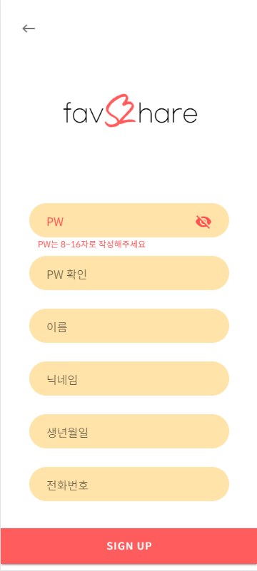
 

### 홈화면
유튜브 탭
 

친구 피드 탭
 
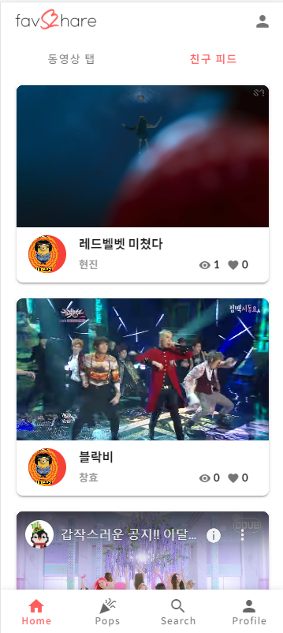
 

### 유튜브 상세정보
유튜브 편집 및 북마크
 
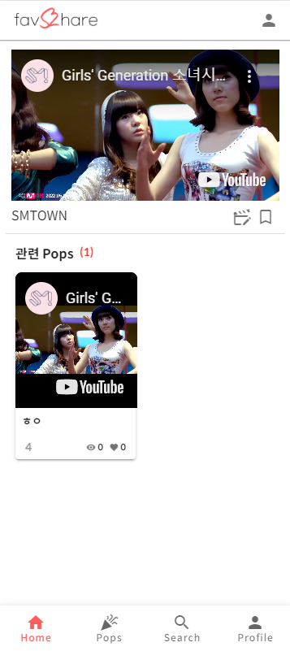
 

### 팝 생성 화면
시간 지정, 피드 설정 후 팝 생성
 
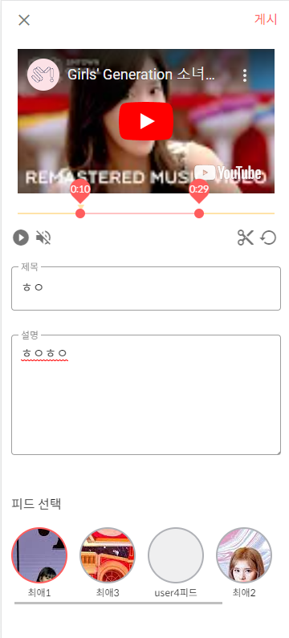

 

### 팝 탭
사용자의 선호도에 맞는 팝 리스트 
 
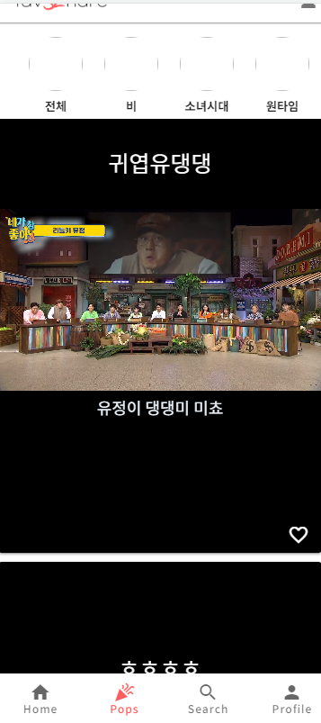

 

### 팝 상세 화면
팝 좋아요 수, 댓글 상세 정보 확인
 

 

### 검색 탭
검색어에 맞는 팝, 동영상, 유저 정보
더보기 제공
 
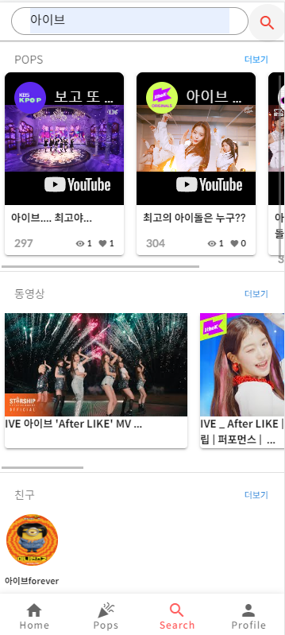

 

### 프로필 탭
유저의 프로필 정보와 피드 정보
 
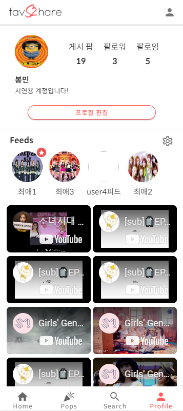

 

### 프로필 정보 변경
비밀번호를 변경할 수 있습니다.
프로필이미지, 닉네임, 자기소개 글을 변경할 수 있습니다.
 
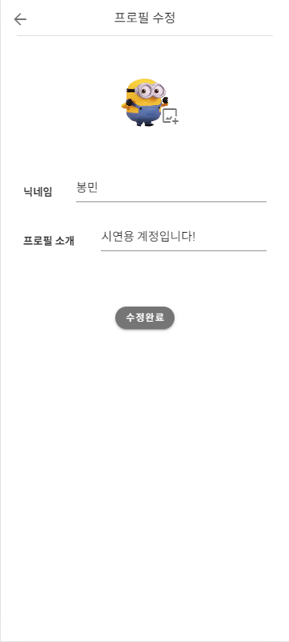
 
---
### 다중 피드
유저가 생성한 다중 피드에 팝 리스트 
 
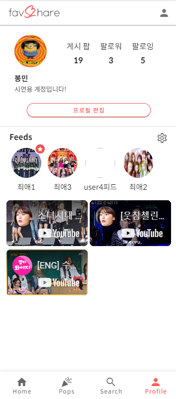

 

### 선호도 조사
유저가 회원가입 후 선호하는 아이돌, 노래 선택 
 
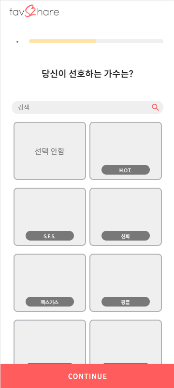

 

### 저장한 유튜브 보기
설정 페이지에서 좋아요한 플레이리스트, 플레이룸, 게시글 목록을 확인할 수 있습니다.
 
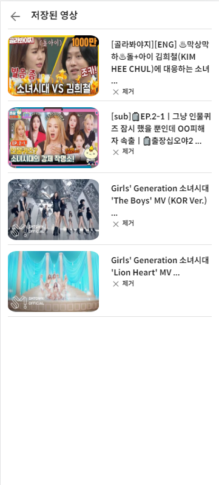

 

### 로그아웃
로그아웃하면 비회원으로 사용
비회원 사용자는 좋아요, 댓글 특정 화면 제한.
 
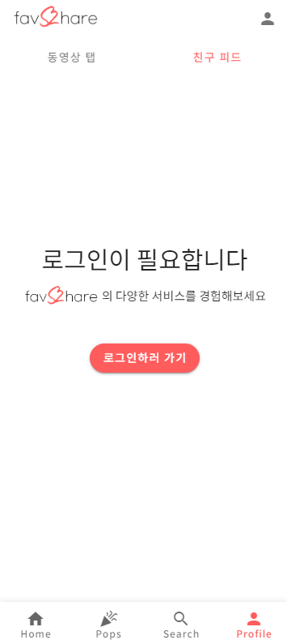
